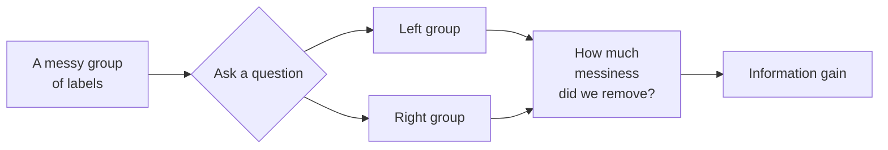

---
tags:
  - course/intro-ml
  - lesson/07
  - walkthrough
lesson: 07
topic: Decision trees - entropy and information gain
status: unread
sources:
  - my_notes.md
  - lecture-07-slides.pdf
  - trees_demo.ipynb
---

> [!info] About this file
> This is an **abridged sample output** of the `learning-walkthrough` skill, kept in the repo so you can see the shape of the deliverable before running it. A real walkthrough covers every concept in the lesson; this one covers a single concept end to end, then shows the closing sections. All arithmetic in it has been verified by running it.

# Lesson 7: Decision trees - entropy and information gain

**What this covers:** How a decision tree decides which question to ask first, using entropy to measure "messiness" and information gain to measure how much a question cleans it up.

**What you'll be able to do by the end:**
- Compute the entropy of a set of labels by hand, in bits.
- Compute the information gain of a candidate split by hand.
- Pick the best split from several candidates and justify the choice.
- Explain why a split that looks obviously good can lose to one that looks boring.

**Built from:** `my_notes.md`, `lecture-07-slides.pdf` (pp. 4-11), `trees_demo.ipynb`, plus Quinlan (1986) for the original formulation.

**Prerequisites:** What a logarithm is (covered in the toolbox below). Nothing else.

**Previous lesson:** [[Lesson 06 - k-Nearest Neighbours]]

---

## 1. The map

Five ideas, and each one exists because of the one before it:

1. **A decision tree** asks a series of yes/no questions to sort items into groups.
2. To build one, we need to choose *which question to ask first* - so we need a score for how good a question is.
3. **Entropy** measures how mixed-up a group of labels is. Pure group → 0. Perfectly mixed → 1 bit.
4. **Information gain** measures how much a question *reduces* entropy. Bigger is better.
5. The tree algorithm just picks the highest-gain question, splits, and repeats.



> [!important] If you remember one thing
> Entropy scores *how mixed a group is*. Information gain scores *how much a question un-mixes it*. The tree greedily picks the question with the highest gain.

---

## 2. Math toolbox

Everything below is used in this lesson. Nothing here is assumed.

| Symbol | Say it out loud | What it means | Tiny example |
|---|---|---|---|
| $\log_2 x$ | "log base two of x" | The power you raise 2 to, to get $x$ | $\log_2 8 = 3$, because $2^3 = 8$ |
| $\sum_{i=1}^{c}$ | "sum from i equals 1 to c" | Add up the following, once per class | 2 classes → compute the term twice, add them |
| $p_i$ | "p-sub-i" | The **proportion** of items in class $i$ | 3 spam out of 4 → $p_{\text{spam}} = 3/4 = 0.75$ |
| $S$ | "S" | A **set** of labelled examples | The 8 emails below |
| $\lvert S \rvert$ | "size of S" | How many examples are in $S$ | $\lvert S \rvert = 8$ |
| $H(S)$ | "H of S" | The **entropy** of set $S$, in bits | $H(S) = 1.000$ when half and half |

### Before we start: what a logarithm actually does

$\log_2 x$ answers one question: **"2 to the what gives me $x$?"**

$$
\log_2 8 = 3 \quad \text{because} \quad 2^3 = 8
$$

Three facts are all this lesson needs:

$$
\begin{aligned}
\log_2 1 &= 0 && \text{because } 2^0 = 1 \\
\log_2 \tfrac{1}{4} &= -2 && \text{because } 2^{-2} = \tfrac{1}{4} \\
\log_2 \tfrac{a}{b} &= \log_2 a - \log_2 b && \text{split a fraction into a subtraction}
\end{aligned}
$$

**Logs of numbers below 1 are negative.** Every $p_i$ is a proportion, so every $\log_2 p_i$ in this lesson is negative - which is exactly why the entropy formula has a minus sign out front. It exists to flip the answer back to positive.

### Constants you'll need on paper

| Value | ≈ | Where it shows up |
|---|---|---|
| $\log_2 3$ | 1.585 | Any group of thirds or quarters that isn't a power of 2 |

---

## 3. Entropy

### 3.1 What problem does this solve?

You have 8 emails. 4 are spam, 4 are not. You want to ask one yes/no question that separates them as cleanly as possible.

Two candidate questions:

- Does the email contain the word "free"?
- Does the email have an attachment?

Both split the 8 emails into two groups. **Which split is better?** You need a number, or you are just guessing. Entropy is that number.

### 3.2 The intuition

> [!tip] The intuition
> Entropy is a **messiness score** for a bag of labels.
>
> - A bag with only spam in it: perfectly tidy. Entropy **0**.
> - A bag that's half spam, half not: maximally messy - a coin flip. Entropy **1 bit**.
> - Anything in between: somewhere between 0 and 1.
>
> "Bits" is literal here: it's the average number of yes/no questions you'd need to identify one item's label. Half-and-half needs exactly one question. A pure bag needs zero - you already know the answer.
>
> **Where the analogy stops:** with more than two classes, entropy can exceed 1 bit (3 equal classes give $\log_2 3 \approx 1.585$). "Between 0 and 1" is a two-class fact, not a general one.

### 3.3 The formula, and every symbol in it

> [!abstract] The formula
> $$
> H(S) = -\sum_{i=1}^{c} p_i \log_2 p_i
> $$

| Symbol | Say it | What it is | Example value |
|---|---|---|---|
| $H(S)$ | "H of S" | Entropy of set $S$, measured in bits | $1.000$ |
| $c$ | "c" | Number of classes | $2$ (spam, not spam) |
| $p_i$ | "p-sub-i" | Proportion of $S$ in class $i$; between 0 and 1 | $0.75$ |
| $-$ (leading) | "minus" | Flips the sign, because every $\log_2 p_i$ is negative | - |

**Read aloud:** *"For each class, multiply its proportion by the log-base-2 of that proportion, add them all up, then flip the sign."*

### 3.4 Where it comes from

The chain in one place, so the minus sign stops being mysterious:

$$
\begin{aligned}
\text{surprise of one outcome} &= \log_2 \tfrac{1}{p_i} && \text{rare outcomes are more surprising} \\
&= -\log_2 p_i && \text{using } \log_2 \tfrac{a}{b} = \log_2 a - \log_2 b \\
H(S) &= \sum_i p_i \cdot (-\log_2 p_i) && \text{average surprise, weighted by how often each happens} \\
&= -\sum_i p_i \log_2 p_i && \text{pull the minus out front}
\end{aligned}
$$

So entropy is just **average surprise**. A pure bag never surprises you, so its entropy is 0.

> [!note]- Aside (optional): the $0 \log 0$ problem
> If a class has zero members, $p_i = 0$ and $\log_2 0$ is undefined. By convention $0 \log_2 0 = 0$, justified by taking the limit as $p \to 0$. In code this shows up as a `p > 0` mask - see `trees_demo.ipynb`, cell 6.

### 3.5 Worked example - by hand

> [!example] Worked example - by hand
> **The dataset.** Eight emails, four spam, four not:
>
> | # | contains "free" | has attachment | sender unknown | label |
> |---|---|---|---|---|
> | 1 | yes | yes | yes | spam |
> | 2 | yes | yes | no | spam |
> | 3 | yes | no | yes | spam |
> | 4 | yes | no | no | ham |
> | 5 | no | no | yes | spam |
> | 6 | no | no | no | ham |
> | 7 | no | no | yes | ham |
> | 8 | no | no | no | ham |
>
> **Step 1 - entropy of the whole set.** 4 spam, 4 ham out of 8:
>
> $$
> \begin{aligned}
> p_{\text{spam}} = \tfrac{4}{8} = 0.5, \quad p_{\text{ham}} &= \tfrac{4}{8} = 0.5 && \text{the two proportions} \\
> H(S) &= -(0.5)\log_2(0.5) - (0.5)\log_2(0.5) && \text{substitute into the formula} \\
> \log_2(0.5) &= -1 && \text{because } 2^{-1} = 0.5 \\
> H(S) &= -(0.5)(-1) - (0.5)(-1) && \text{put the log values back in} \\
> &= 0.5 + 0.5 && \text{two double negatives} \\
> &= \mathbf{1.000 \text{ bits}} && \text{maximally messy, as expected}
> \end{aligned}
> $$
>
> **Step 2 - split on "contains free".** Rows 1-4 go left (3 spam, 1 ham); rows 5-8 go right (1 spam, 3 ham).
>
> $$
> \begin{aligned}
> H(\text{left}) &= -\tfrac{3}{4}\log_2\tfrac{3}{4} - \tfrac{1}{4}\log_2\tfrac{1}{4} && \text{substitute the counts} \\
> \log_2\tfrac{3}{4} &= \log_2 3 - \log_2 4 = 1.585 - 2 = -0.415 && \text{split the fraction} \\
> \log_2\tfrac{1}{4} &= -2 && \text{because } 2^{-2} = \tfrac14 \\
> H(\text{left}) &= -(0.75)(-0.415) - (0.25)(-2) && \text{put them back in} \\
> &= 0.311 + 0.500 && \text{signs cancel both times} \\
> &= 0.811 \text{ bits} && \text{(3 d.p.)}
> \end{aligned}
> $$
>
> The right branch is 1 spam and 3 ham - the mirror image - so $H(\text{right}) = 0.811$ bits too. No need to recompute it; entropy doesn't care which label is which.
>
> **Step 3 - split on "has attachment".** Rows 1-2 go left (2 spam, 0 ham); rows 3-8 go right (2 spam, 4 ham).
>
> $$
> \begin{aligned}
> H(\text{left}) &= -\tfrac{2}{2}\log_2\tfrac{2}{2} = -(1)\log_2(1) = -(1)(0) = \mathbf{0} && \text{a pure group: no surprise at all} \\[6pt]
> H(\text{right}) &= -\tfrac{2}{6}\log_2\tfrac{2}{6} - \tfrac{4}{6}\log_2\tfrac{4}{6} && \text{substitute 2 spam, 4 ham} \\
> &= -\tfrac{1}{3}\log_2\tfrac{1}{3} - \tfrac{2}{3}\log_2\tfrac{2}{3} && \text{simplify both fractions} \\
> \log_2\tfrac{1}{3} &= -\log_2 3 = -1.585 && \\
> \log_2\tfrac{2}{3} &= 1 - 1.585 = -0.585 && \log_2 2 - \log_2 3 \\
> H(\text{right}) &= -(0.333)(-1.585) - (0.667)(-0.585) && \\
> &= 0.528 + 0.390 && \\
> &= 0.918 \text{ bits} && \text{(3 d.p.)}
> \end{aligned}
> $$
>
> **The punchline is coming.** "Contains free" gave two branches of 0.811 each. "Has attachment" gave one perfect branch (0) and one *worse* branch (0.918). Which is better? Entropy alone can't say - the branches are different sizes. That's what information gain is for, and it's the next section.

### 3.6 Your turn

> [!question]- Your turn
> Compute the entropy of a group containing **6 spam and 2 ham**.
>
> Hints: the proportions are $6/8$ and $2/8$. You'll need $\log_2 3 \approx 1.585$. Your answer should be between 0 and 1 bits, and closer to 0 than to 1 - the group is fairly pure.

> [!success]- Answer
> $$
> \begin{aligned}
> p_{\text{spam}} = \tfrac{6}{8} = 0.75, \quad p_{\text{ham}} &= \tfrac{2}{8} = 0.25 \\
> H &= -(0.75)\log_2(0.75) - (0.25)\log_2(0.25) \\
> \log_2(0.75) &= \log_2 3 - \log_2 4 = 1.585 - 2 = -0.415 \\
> \log_2(0.25) &= -2 \\
> H &= -(0.75)(-0.415) - (0.25)(-2) \\
> &= 0.311 + 0.500 \\
> &= \mathbf{0.811 \text{ bits}}
> \end{aligned}
> $$
>
> **Notice:** identical to the 3-spam-1-ham branch above. Entropy depends only on the *proportions*, never on the group's size. That fact is exactly why information gain has to weight branches by size - hold onto it.

### 3.7 Where it breaks

> [!warning] Where it breaks
> - **Your probabilities don't sum to 1.** You divided by the wrong total - use the size of *that branch*, not the whole dataset.
> - **You got a negative entropy.** You dropped the leading minus sign. Entropy is never negative.
> - **You got entropy above 1 with two classes.** Arithmetic slip: with $c = 2$, the maximum is exactly 1 bit.
> - **You tried to compute $\log_2 0$.** A class with zero members contributes exactly 0. Skip the term.
> - **Entropy alone doesn't pick the split.** A branch with 1 item can have entropy 0 and mean nothing. Sizes matter - see information gain.

### 3.8 In the code

`trees_demo.ipynb`, cell 6:

```python
def entropy(labels):
    counts = np.bincount(labels)
    p = counts[counts > 0] / len(labels)   # the p_i, with empty classes dropped
    return -np.sum(p * np.log2(p))         # the formula, verbatim
```

Two things worth noticing. `counts > 0` is the $0 \log 0$ convention from the aside above, enforced in code. And `np.log2` confirms this course uses base 2 throughout - some textbooks use natural log, which changes the units from bits to "nats" but never changes which split wins.

---

*[In a full walkthrough, section 4 covers information gain the same way, and section 5 runs all three candidate splits end to end. The verified results: "contains free" gains 0.189 bits, "sender unknown" gains 0.189 bits, and "has attachment" gains **0.311 bits** - the boring-looking question wins, because its pure branch is worth more than its messy one costs.]*

---

## 6. Cheat sheet

Copy this onto one sheet of paper. Then close the sheet and rewrite it from memory.

| Concept | Formula | In words |
|---|---|---|
| Entropy | $H(S) = -\sum_i p_i \log_2 p_i$ | Messiness of a bag of labels, in bits |
| Pure group | $H = 0$ | One class only |
| Max entropy, 2 classes | $H = 1$ | Exactly half and half |
| Weighted child entropy | $\sum_v \frac{\lvert S_v \rvert}{\lvert S \rvert} H(S_v)$ | Average child messiness, weighted by branch size |
| Information gain | $IG(S, A) = H(S) - \sum_v \frac{\lvert S_v \rvert}{\lvert S \rvert} H(S_v)$ | Messiness removed by asking question $A$ |
| Split rule | $\arg\max_A IG(S, A)$ | Ask the question with the highest gain |

| Useful values | | |
|---|---|---|
| $\log_2 3 \approx 1.585$ | $\log_2 \tfrac12 = -1$ | $\log_2 \tfrac14 = -2$ |

---

## 7. Check yourself

- [ ] **Recall.** Write the entropy formula from memory, then name every symbol in it.
- [ ] **Compute.** What is the entropy of a group with 5 spam and 5 ham?
- [ ] **Compute.** A split produces branches of size 2 (entropy 0) and size 8 (entropy 1). What is the weighted child entropy?
- [ ] **Explain.** In your own words, why does the entropy formula start with a minus sign?
- [ ] **Explain.** Why does information gain weight each branch by its size, when entropy itself ignores size?
- [ ] **Transfer.** A feature splits 8 emails into 8 branches of 1 email each. Every branch has entropy 0, so the gain is maximal. What has gone wrong, and what does this suggest about using raw information gain on high-cardinality features?
- [ ] **Discriminate.** [[Lesson 06 - k-Nearest Neighbours]] chose neighbours by distance; this lesson chooses splits by gain. For a dataset of mostly categorical features with no meaningful distance metric, which method applies, and why?

---

## 8. Answers

> [!success]- Answer 2
> 5 and 5 out of 10 → $p = 0.5$ each → $H = -(0.5)(-1) - (0.5)(-1) = \mathbf{1.000}$ bit. Perfectly mixed, exactly as with 4 and 4 - only the proportions matter.

> [!success]- Answer 3
> $$\tfrac{2}{10}(0) + \tfrac{8}{10}(1) = 0 + 0.8 = \mathbf{0.800 \text{ bits}}$$
> The small pure branch barely helps, because only 2 of the 10 items land in it.

> [!success]- Answer 6
> This is **overfitting via a high-cardinality feature** - an ID column would do exactly this, achieving perfect gain while learning nothing generalisable. Quinlan's fix in C4.5 is the *gain ratio*, which divides gain by the entropy of the split itself, penalising splits that fragment the data. Covered in [[Lesson 08 - Pruning and Gain Ratio]].

---

## 9. Sources

### From your course materials

- Course lecture 7 slides, `lecture-07-slides.pdf`, pp. 4-11.
  - used for: the entropy and information gain definitions, and the worked spam example's structure.
  - status: current; matches the standard formulation.
- Quinlan, J. R. (1986). Induction of Decision Trees. *Machine Learning*, 1(1), 81-106.
  - used for: the original ID3 information-gain split criterion.
  - status: superseded in practice by C4.5's gain ratio (Quinlan, 1993) and by CART's Gini impurity, which most libraries default to. ID3 remains the clearest version to learn on.

### Additional reading

- Shannon, C. E. (1948). A Mathematical Theory of Communication. *Bell System Technical Journal*, 27.
  - read this if: you want to know why entropy is measured in *bits* and where "average surprise" comes from.
- Hastie, T., Tibshirani, R., & Friedman, J. (2009). *The Elements of Statistical Learning*, ch. 9.2.
  - read this if: you want the comparison between entropy and Gini impurity, and why the choice rarely matters much in practice.
